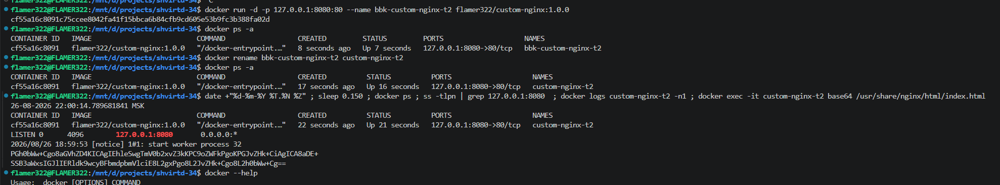
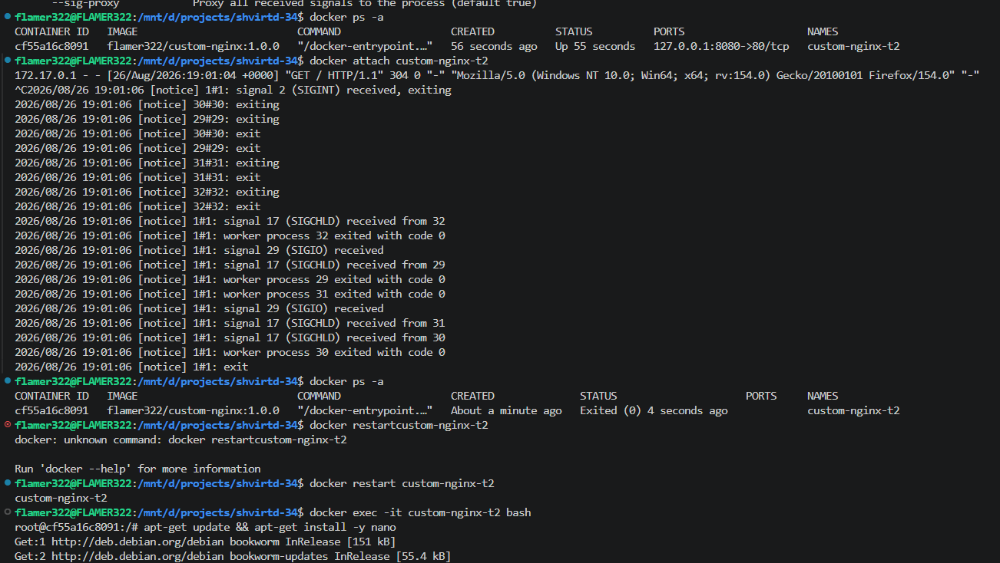
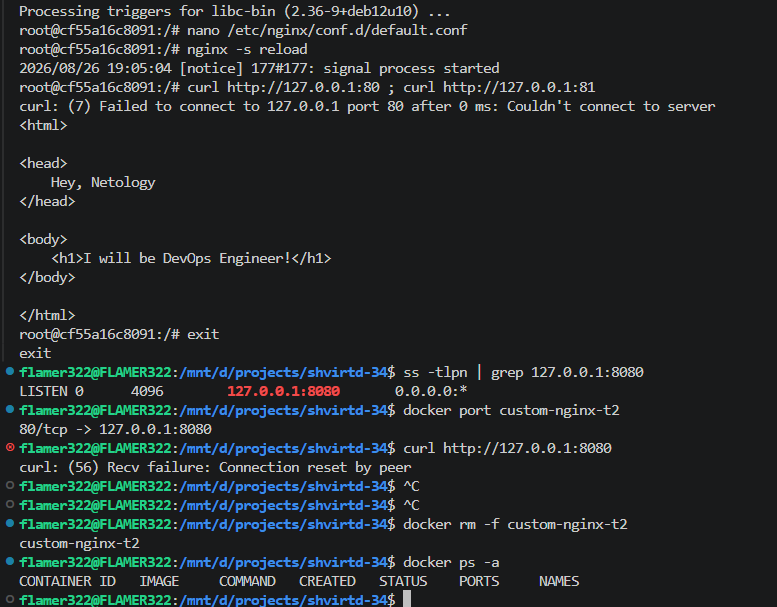
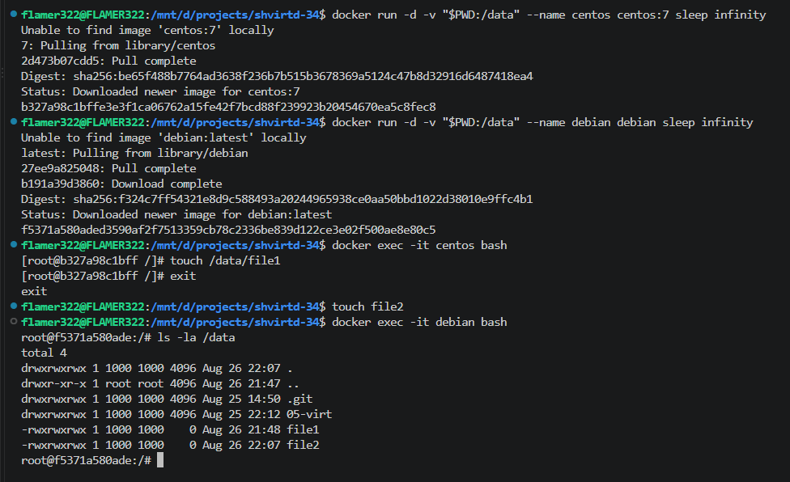
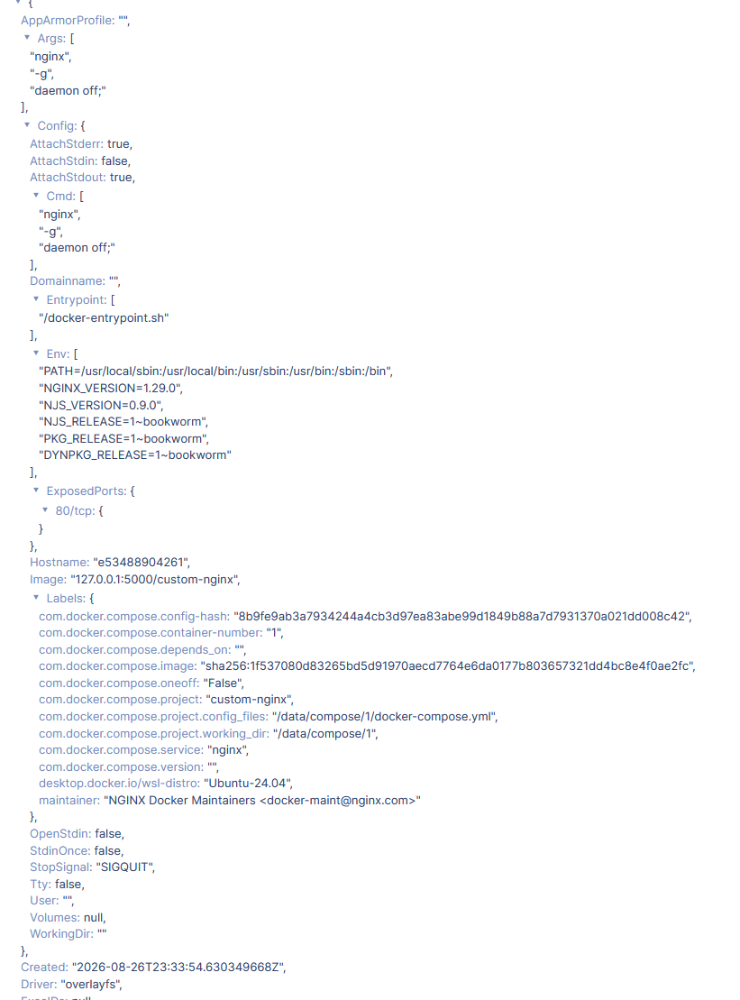
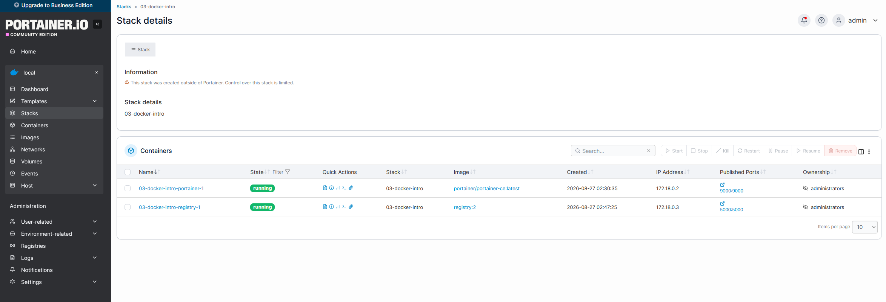
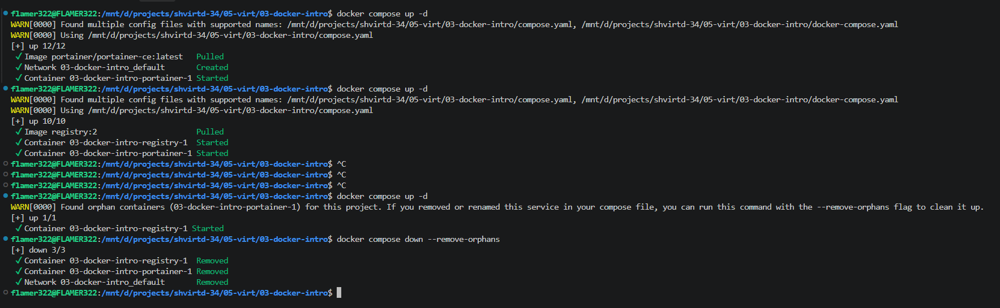

# Домашнее задание к занятию 4. «Оркестрация группой Docker контейнеров на примере Docker Compose»

## Задача 1

Ссылка в требуемом формате - <https://hub.docker.com/flamer322/custom-nginx/general>

## Задача 2

Скриншот консоли

## Задача 3

Контейнер останавливается при Ctrl+C в консоли, т.к. он прерывает процесс nginx, который обрабатывает контейнер

Проблема с curl после изменения вызывана тем, что nginx внутри контейнера слушает 81 порт, а docker пробрасывает 80

## Задача 4

Скриншот консоли

## Задача 5

Config контейнера custom-nginx

Скриншот portainer

Скриншот консоли

