# Домашнее задание к занятию 5. «Практическое применение Docker»

## Задача 1

Dockerfile с multistage сборкой

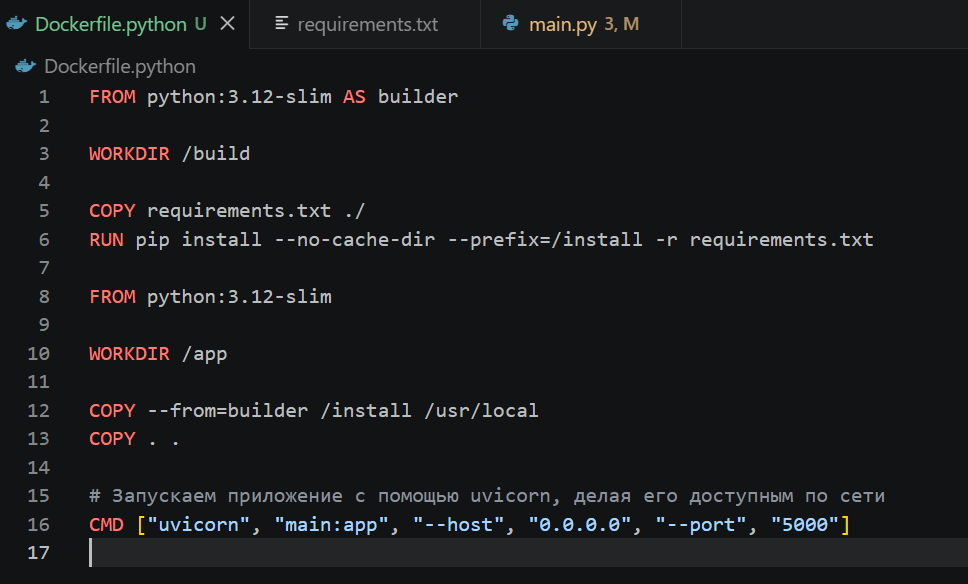

Запуск БД и приложения в docker

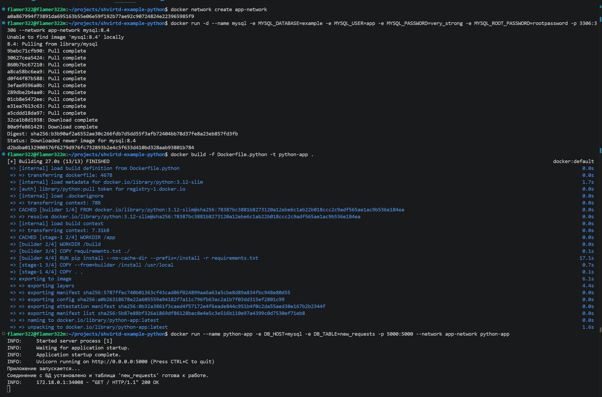

Запуск приложения при помощи venv

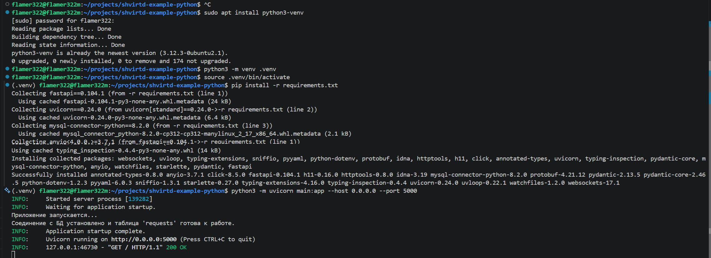

Изменённый код для управления названием таблицы - <https://github.com/Flamer322/shvirtd-example-python/blob/main/main.py>

Записи в новой таблице

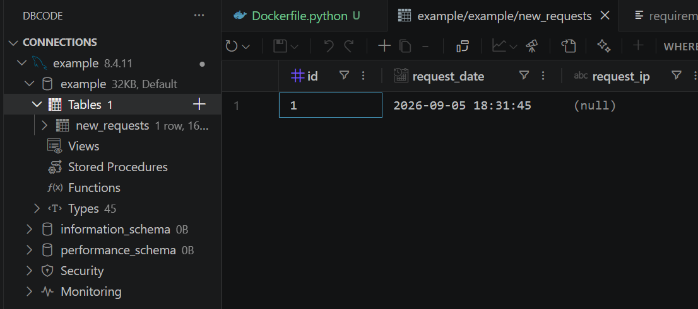

## Задача 2

Результат сканирования

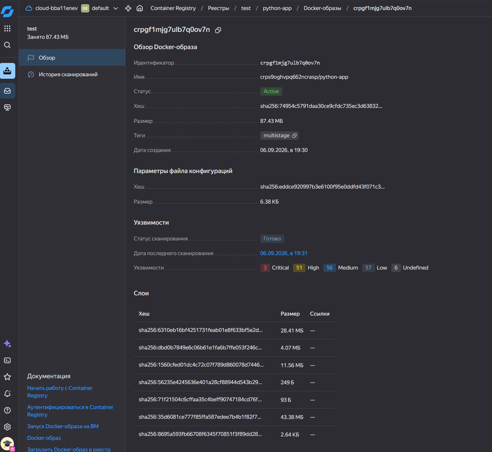
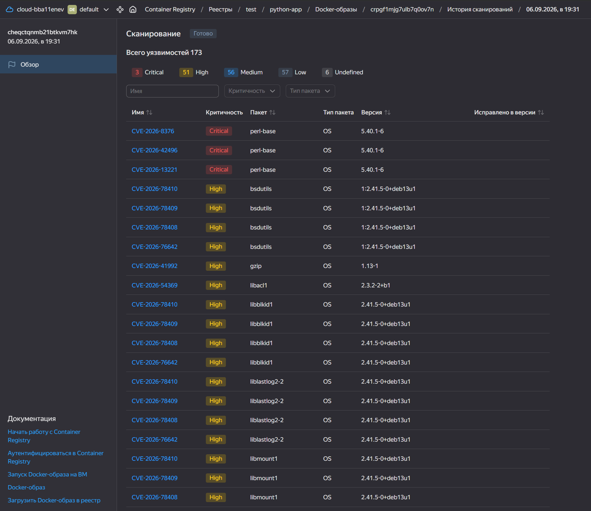

Файл отчёта - [vulnerabilities.csv](vulnerabilities.csv)

## Задача 3

Compose.yaml с include и сервисами web и db - <https://github.com/Flamer322/shvirtd-example-python/blob/main/compose.yaml>

Скриншот sql-запроса

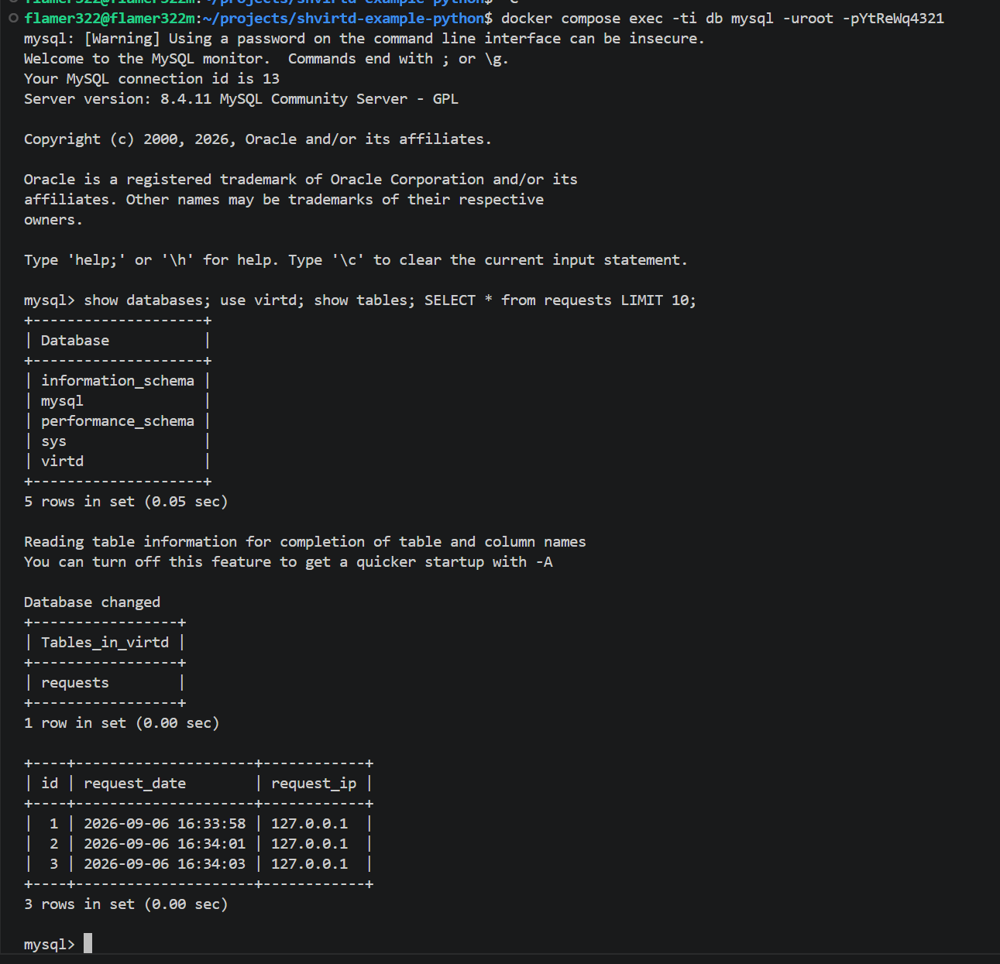

## Задача 4

Ссылка на скрипт для установки и запуска - <https://github.com/Flamer322/shvirtd-example-python/blob/main/install.sh>  
Репозиторий скачивается в /opt/app, т.к. в /opt уже есть директория containerd

ВМ добавлена в ssh config

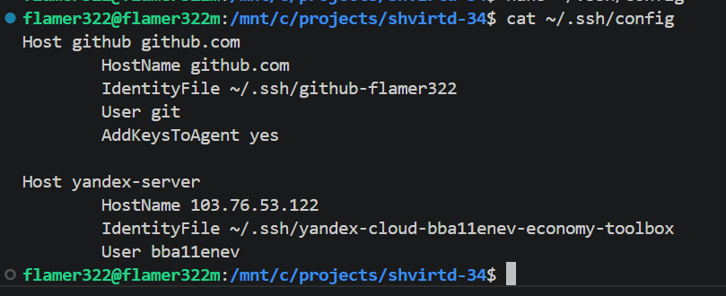

Контекст добавлен при помощи hostname из ssh config, список контекстов и результат удалённого docker ps -a

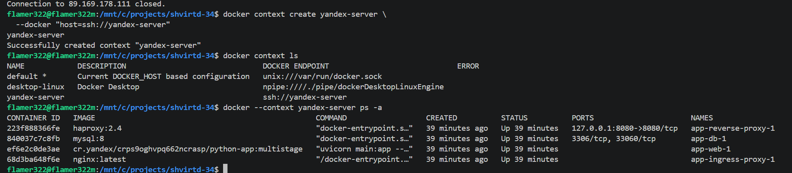

Скриншот sql-запроса в ВМ

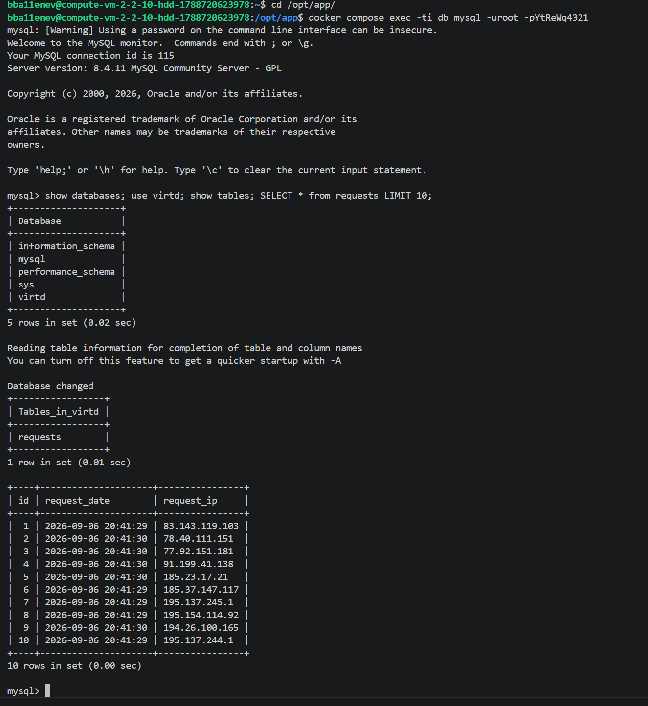

Ссылка на fork - <https://github.com/Flamer322/shvirtd-example-python/tree/main>

## Задача 5

Ссылка на скрипт для бэкапа - <https://github.com/Flamer322/shvirtd-example-python/blob/main/backup.sh>  
Был использован отличный docker образ, который может работать с caching_sha2_password 

Crontab и созданные резервные копии

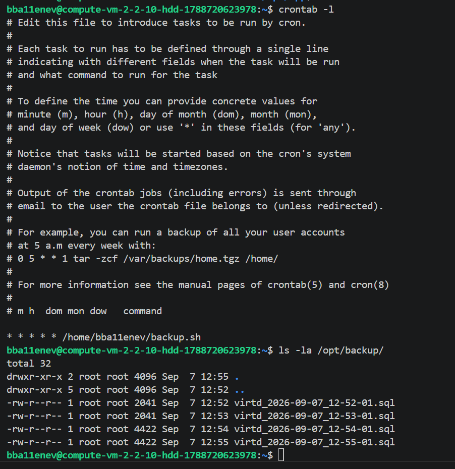

## Задача 6

Вывод dive

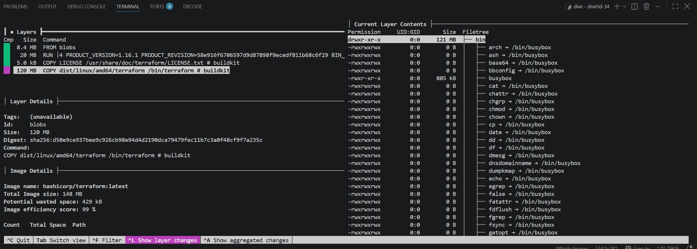

Сохранение образа docker, просмотр его слоёв

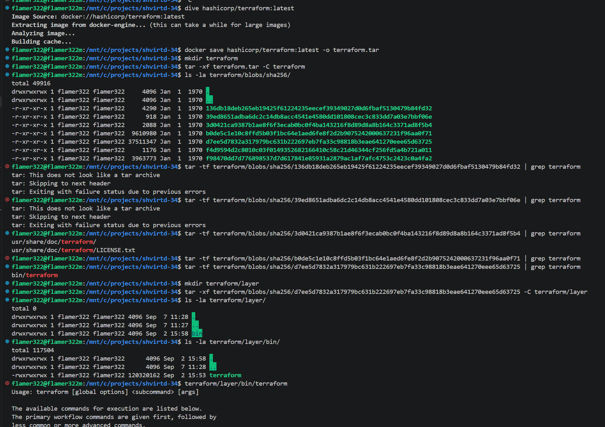
