# Домашнее задание к занятию «Введение в Terraform»

## Задача 0

Склонированный проект, установленные terraform и docker

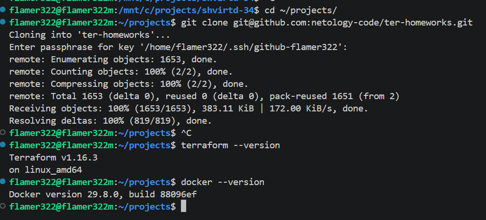

## Задача 1

Установка зависимостей terraform

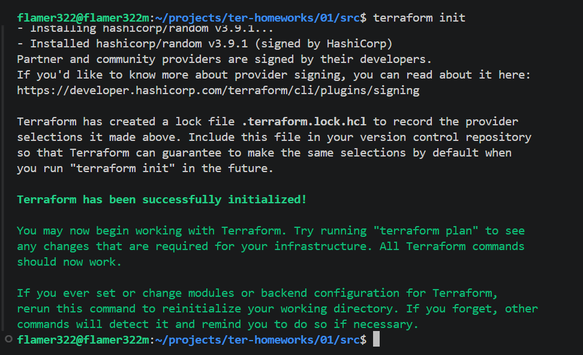

Файл terraform для секретов в проекте - personal.auto.tfvars

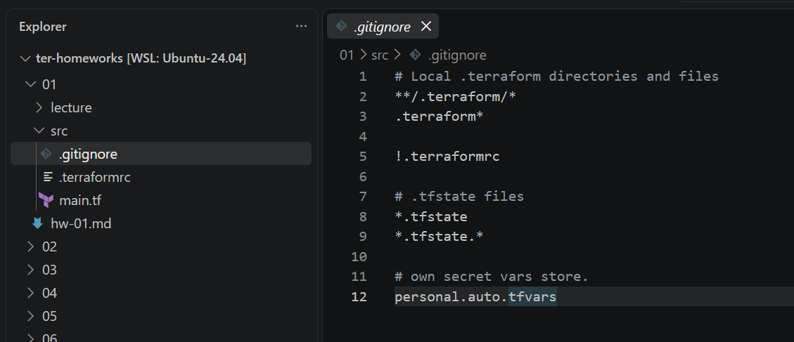

Содержимое ресурса random_password в terraform.tfstate

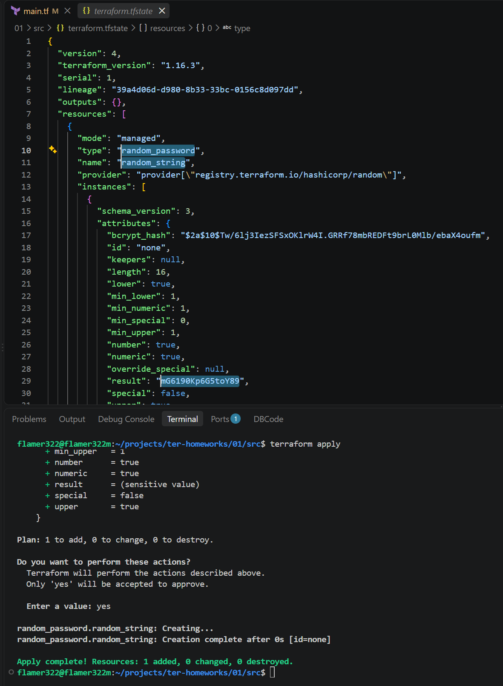

Ошибки в конфигурации - недостающий label с именем ресурса и некорректное имя ресурса

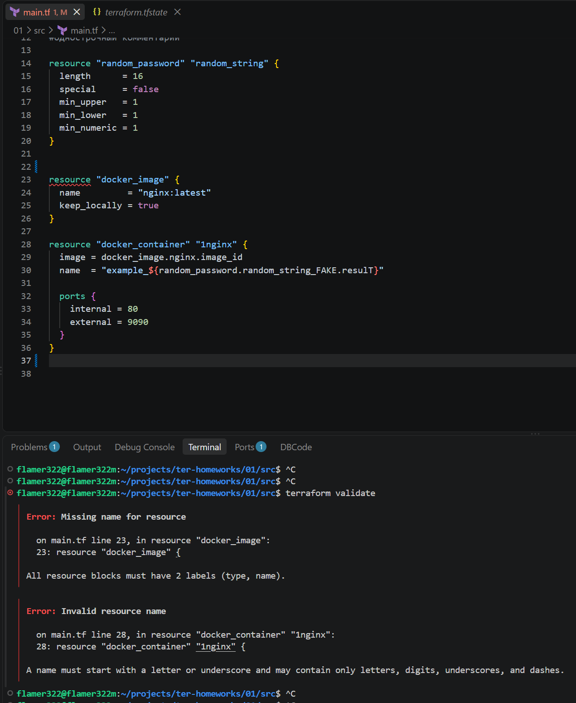

Ошибки в конфигурации - неправильное имя ресурса с паролем и неправильное имя атрибута с результатом

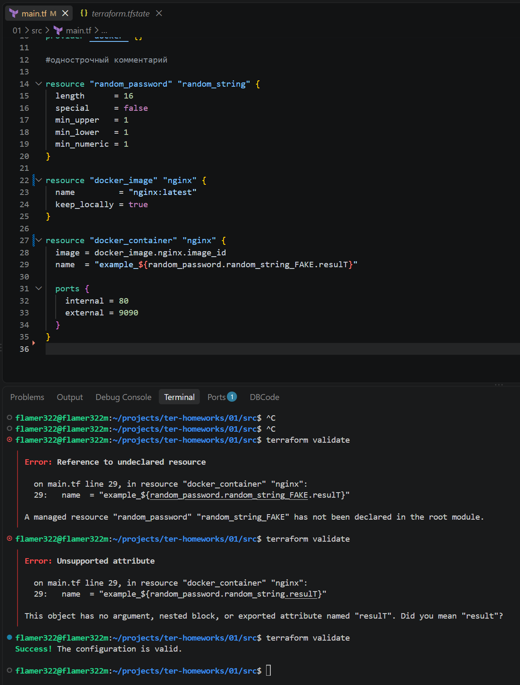

Исправленная конфигурация, успешное выполнение и вывод `docker ps`

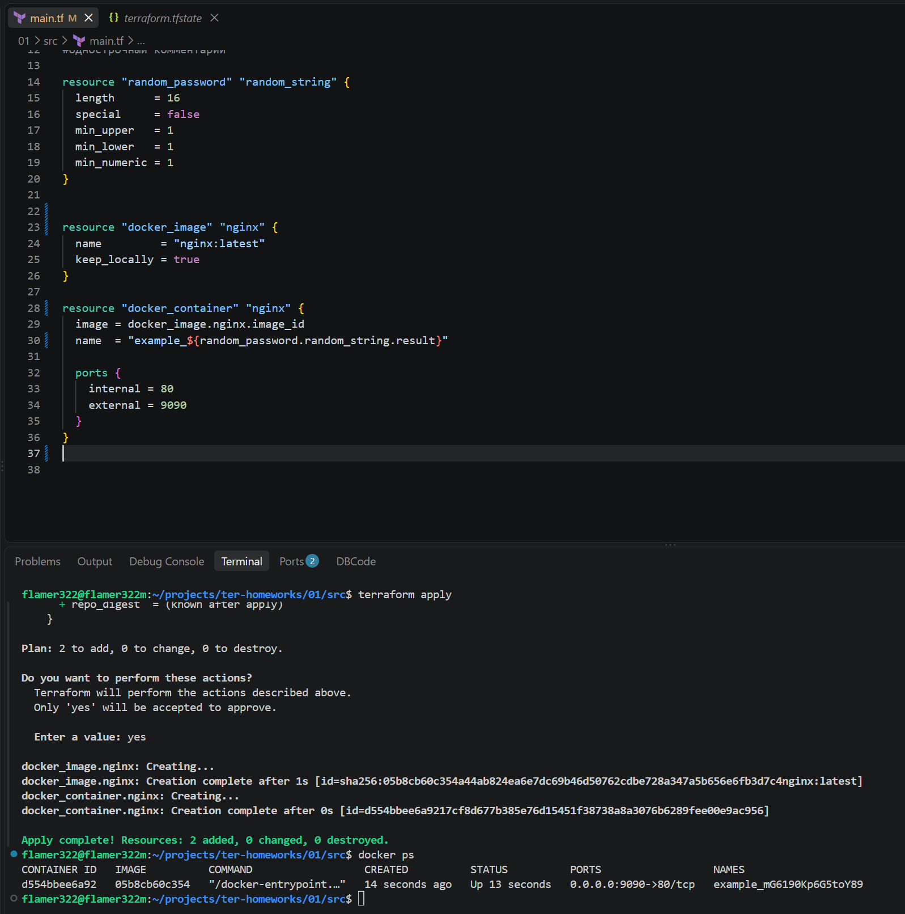

Изменённое имя контейнера и вывод `docker ps`  
Ключ `-auto-approve` может быть использован для автоматизации, так как с ним не требуется подтверждение действия. Однако при его использовании можно применить ошибочную конфигурацию, не имея возможности отреагировать на план изменений

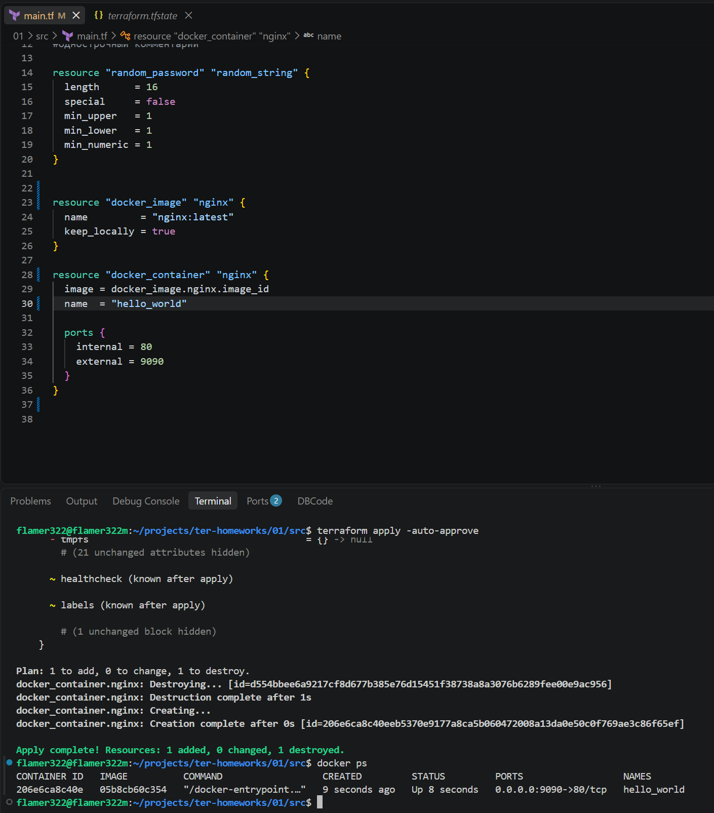

Уничтожение созданных ресурсов и содержимое terraform.tfstate

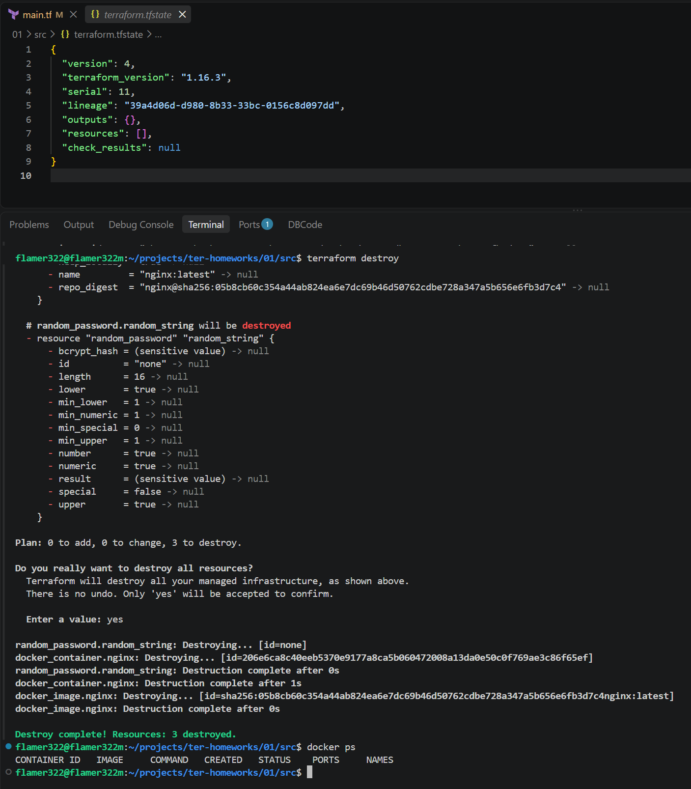

Docker-образ не удаляется из-за флага `keep_locally`. При его установке в `true`, terraform не удаляет образ даже при удалении ресурсов проекта

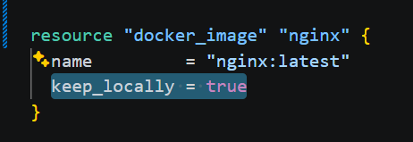
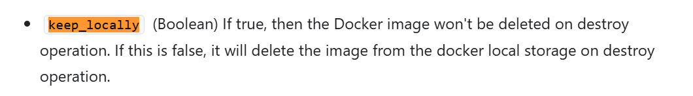

## Задача 2

Создание ВМ в yandex cloud при помощи terraform  
Конфигурация для создания ВМ - [main.tf](src/yandex-cloud/main.tf)

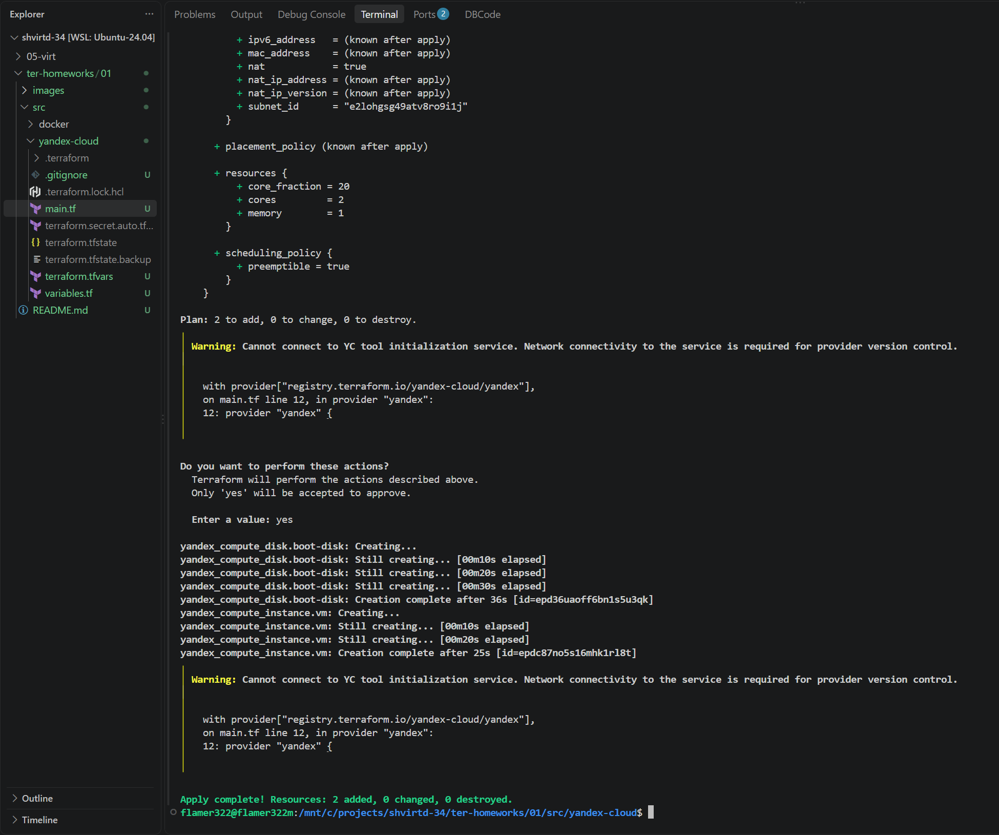

Установка docker на созданной ВМ

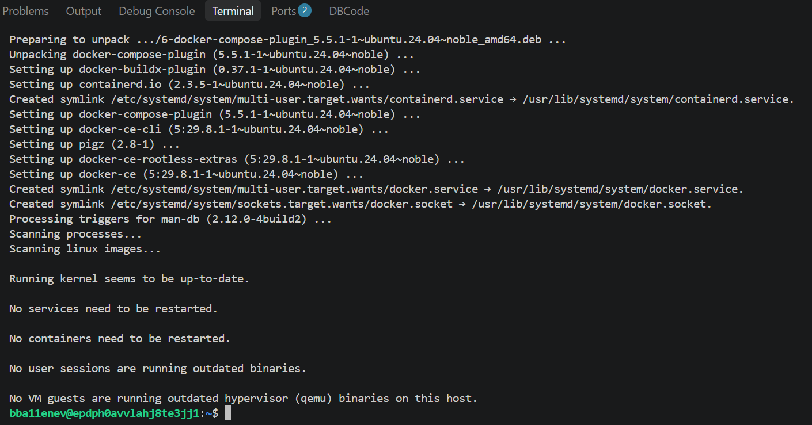

Запуск контейнера на ВМ при помощи terraform и удалённого docker контекста  
Конфигурация для запуска контейнера - [main.tf](src/docker/main.tf)

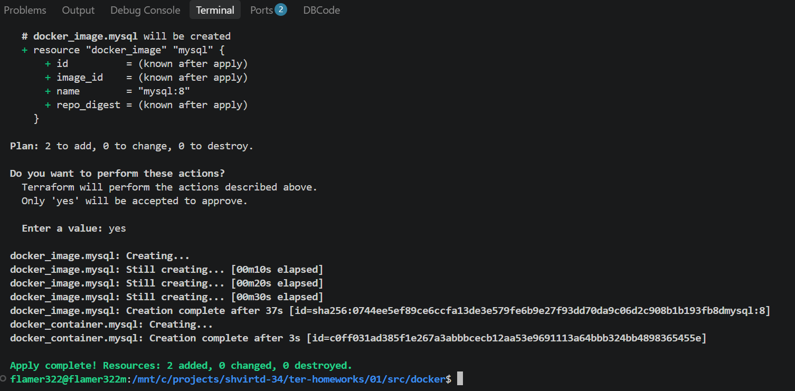

Проверка env переменных внутри контейнера

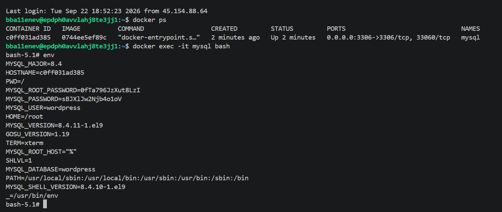

## Задача 3

Выполненение кода при помощи opentofu (предварительно были переустановлены зависимости при помощи `tofu init`)

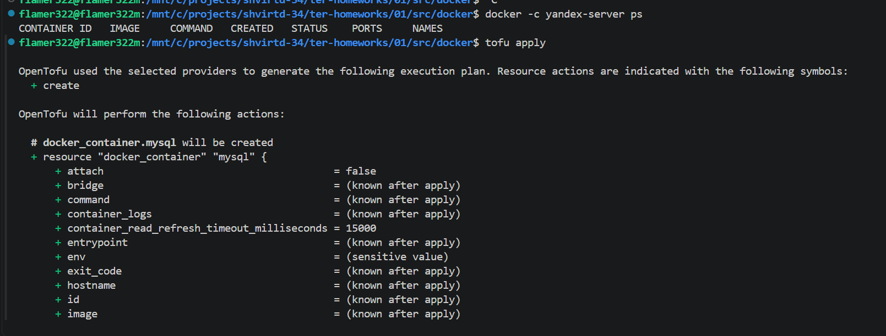
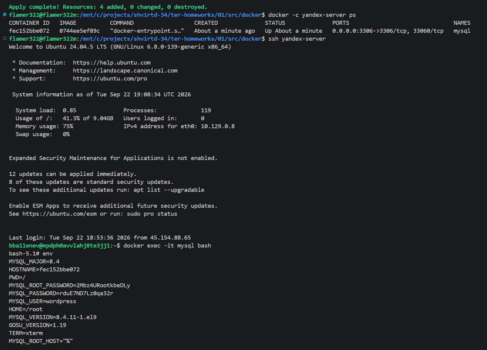
